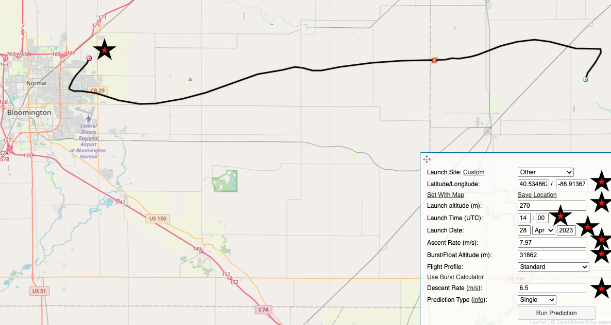

# How To Launch a High Altitude BAlloon (HAB) For Carrying The Project

## Overview

## Prediction Details

### Burst Calculations

[SondeHub Burst Calculation Website](https://sondehub.org/calc/)

- Modify the fields with a red star for your needs:
  - Payload Mass is the weight of everything below the balloon you will be flying in grams. A simple [Google search](https://www.google.com/search?q=pounds+to+grams&oq=pounds+to+gram&aqs=chrome.0.35i39j69i57j0i512l8.4770j0j7&sourceid=chrome&ie=UTF-8) will yield the conversions
    - Rigging line(s), parachute, payload harness, Payload nd contents, and anything attached to the payload
  - Ballon Mass is the size balloon you will be flying. Be sure to select the proper size AND manufacturer. It's not a bad idea to validate the specs as we found the burst diameter a bit off.
  - Target Ascent rate in meters per second
    - For best camera results an ascent of 6 meters per second is optimal but you will likely need a different rate based on your lift gas volume
      - A flow gauge can be used to dial in the right amount of gas but they are typically cost prohibitive. These gauges are typically different for each type of gas as well.
    - You will need to modify this until the volume changes to your lift gas tank volume. A simple [Google search](https://www.google.com/search?q=cubic+feet+to+meters&sxsrf=APwXEdcz7Z9132iZwT_5k74WRE1ANWrVwA%3A1682485057227&ei=Qa9IZLvEDf-iptQP4aqroAg&ved=0ahUKEwj76LOh4cb-AhV_kYkEHWHVCoQQ4dUDCBA&uact=5&oq=cubic+feet+to+meters&gs_lcp=Cgxnd3Mtd2l6LXNlcnAQAzIFCAAQgAQyBQgAEIAEMgUIABCABDIFCAAQgAQyBggAEBYQHjIICAAQFhAeEA8yBggAEBYQHjIGCAAQFhAeMgYIABAWEB4yBggAEBYQHjoECCMQJzoHCAAQigUQQzoKCAAQigUQsQMQQzoNCC4QigUQsQMQgwEQQzoLCAAQgAQQsQMQgwE6CAgAEIoFEJECOgsIABCKBRCxAxCRAkoECEEYAFAAWP0kYKInaABwAXgAgAHIAYgB0BKSAQYxLjE4LjGYAQCgAQHAAQE&sclient=gws-wiz-serp) can convert m3 to cubic feet
   - Gas needs to be changed ot the lift gas you will be using. The calculations will be different for each lift gas option!

## Landing Prediction Calculator

[Sonde HAB Prediction Calculator](https://predict.sondehub.org/)

- Modify the fields with a red star for your needs:
  - Latitude and Longitude
    - You can use many tools like [maps.google.com](maps.google.com)
      - Find the location best suited for winds at launch time and place a waypoint. The latitude and longitude will be shown or copied easily from the shared link
  - Launch Altitude
    - THis can be determined with many tools like Google Earth, USGS, [websites](https://whatismyelevation.com/), etc
      - Be sure to convert to meters
  - Launch time UTC
    - [Convert](https://www.google.com/search?q=what+time+is+it+utc&oq=What+time+is+it+utc&aqs=chrome.0.35i39j0i512l9.2977j0j7&sourceid=chrome&ie=UTF-8) local time to UTC
- Launch Date
- Ascent Rate (m)
  - This was claculated fromt he above instructions on [SondeHub Burst Calculation Website](https://sondehub.org/calc/)
- Burst/Float Altitude (m)
  - This was claculated fromt he above instructions on [SondeHub Burst Calculation Website](https://sondehub.org/calc/)
- Descent Rate (m/s)
  - this will be defined by your parachute. Be sure you calculate based on the adjustments on your actual parachute as many can be reduced

### Pre-work / pre-launch
- Build payloads
  - Add camera mounts in the payload (top and side)
  - Mount external temp sensor and route wires to the logger
  - Mount VHF antennas / dowell rods
  - Attach antennas to tracker (HF and VHF)
  - Program tracker
    - VHF APRS
    - HF WSPR
    - Other?
  - Charge battery packs
  - Load batteries in the battery holders for the tracker and data logger
  - Test cams
  - Make rigging lines for filling and safety
    - Two tethers for filling and moving to flight pad
    - rigging for payload attachment
  - Load everything needed for launch
  - Weather check / go no go
  - Prediciton calculation / go no go
  - Validate location of launch based on wind prediciton
  - File airmens bulliten with the FAA / local tower
  
- Day of launch
  - Weather check / go no go
  - Prediciton calculation / go no go
  - Setup filling station
    - Stake tarp
    - Unload tanks
    - Ground tank
    - Setup filler
    - Setup rigging lines w caribeaners
    - Undo balloon bag rubberbands
    - 
  - Setup launch pads
    - stake tarp
    - Attach line to weight
    - Ensure team has their task list
    - Setup payload
      - Setup payload downwind
      - Attach rigging line to parachute
      - Attach rigging line to parachute to payload
      - Attach payload rigging harness
      - Power on battery pack(s)
      - Power on tracker
        - Ensure pings are working on APRS and WSPR
      - Power on student data logger
      - Ensure all items are secure (duct tape where needed)
      - Setup cameras
        - Plug into power
        - Set camera options
        - Secure in camera holders
      - Run prediciton and share content / go no go
    - Fill balloon
      - Gloves on for anyone handling the balloons
      - Unroll balllon from UV bag
      - Attach neck to filler and tape
      - Add zips to balloon neck semi snug
      - Attach zip - safety harness 1 to weight at filling station
      - Attach zip -  safety harness 2 to tank
      - Attach payload rigging to zip
      - Open gas and fill balloon  semi slow
      - Once tank is empty start sealing process
        - Move top zip up and seal tight
          - Clip excess
          - Tape sharp ends
        - Move second zip up and zip tight with safety harness to weight
        - Undo tape on filler nozzle and remove filler
        - Zip payload harness zip
          - Clip excess
          - Tape sharp ends
        - Tighten final zip
          - Clip excess
          - Tape sharp ends
        - Zip bottom of neck to above top zip
          - Clip excess
          - Tape sharp ends
      - Move ballon to launch location
        - Balloon handler will bring their weight and harness to the fill location
        - Clip launch pad weight to balloon
        - Unclip fill weight harness
        - Walk to launch location
        - Attach payload train to the payload harness
        - Confirm payload train is running downwind and untangled with little slack
      - Fill next balloon(s) as directed above and move to launch pad(s)
      - Confirm tracker telemetry being recieved from balloon(s)
      - Unclip weights holding payload rigging
      - Countdown / release!
        - Repeat other balloon(s)

## Laws and Regulations
- [Code of Federal Regulations - PART 101 - MOORED BALLOONS, KITES, AMATEUR ROCKETS, AND UNMANNED FREE BALLOONS](https://www.ecfr.gov/current/title-14/chapter-I/subchapter-F/part-101)
- [FAA Order JO 7110.65Z - Air Traffic Control](https://www.faa.gov/air_traffic/publications/atpubs/atc_html/chap9_section_6.html)

## Supplies

## [See seperate section on tracking](/amateur_radio/README.md)

## Helpful links

