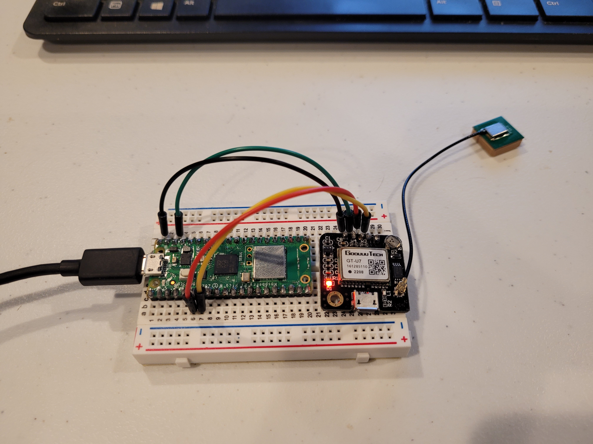
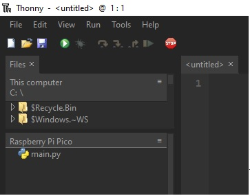
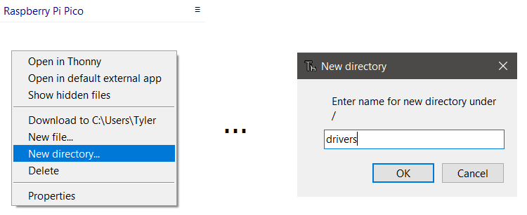
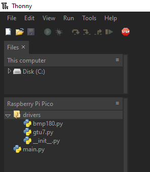

# Lesson 4: GPS Coordinates

## High Altitude Balloon Data Logging

### Pre-requisites
* Complete [Lesson 1: Blinking Light](../lesson1/README.md)
* [Thonny Python IDE](https://thonny.org/) installed on your computer
* All necessary hardware components (Raspberry Pi Pico, GTU-7 module, breadboard, wires, USB cable, computer)

### Objectives
* Use breadboard to wire GTU-7 module to Raspberry Pi Pico
* Install the GTU-7 MicroPython driver to the Raspberry Pi Pico
* Print GPS coordinates to the console

### Results
* Familiarity with wiring a breadboard
* Understanding of basic MicroPython code
* Learn the importance of MicroPython drivers and how to use them
* A functioning program for reading GPS data and printing the information to the console<br><br>

### Video Walk-through
In addition to the reading below, you can watch this [video](./docs/videos/Lesson4.mp4?raw=true) for guidance!
<br><br>

## Steps

  **IMPORTANT** Before wiring your Pico, UNPLUG IT FROM YOUR COMPUTER. If plugged in while wiring, you risk damaging the Pico or GT-U7 module.

1. Wire the GT-U7 to the Raspberry Pi Pico.
    GT-U7 Pins | Description | Pi Pico Pins
    ------------ | ----------- | ------------
    VCC          | (Voltage In): Provides power. Connect to the 5V pin on Pico | 5V (40)
    GND          | (Ground): Connect to the ground pin on Pico | GND (38)
    PPS          | (Pulse Per Second): Assists with synchronization | N/A
    TXD          | (Transmit): Transmission pin used for serial communication | UART1 RX / GP5 (7)
    RXD          | (Receive): Receiver pin used for serial communication | UART1 TX / GP4 (6)

    

    

### Install GT-U7 Driver

Drivers are code modules for enabling certain functionality. One such driver allows us to read data from the GTU-7 module. This driver is called `gtu7.py` and is located in the [../drivers/src/gtu7.py](../drivers/src/gtu7.py) location. The following steps will result in saving this driver to the Raspberry Pi Pico so the driver can be used by our Python code.

1. Download the driver called `gtu7.py` located in the [../drivers/src/gtu7.py](../drivers/src/gtu7.py) location to a directory/file/location of your choice. Remember where you downloaded the driver to for a later step.

1. Connect your Raspberry Pi Pico to your computer using the USB cable.

1. Open the Thonny IDE. _Stop/Restart_ the backend to refresh the connection.

    

    You should now see `Raspberry Pi Pico` displayed in the left-hand navigation of Thonny.If the "Files" window is not displaying add it from the View > Files menu.

    

1. If one does not already exist, create a new directory in Thonny on the Raspberry Pi Pic called `drivers`.
    
    

1. Using Thonny, select _File_ then _Open_ from the menu. Choose _This Computer_. Navigate to the location where you downloaded `gtu7.py` in step 1. Select the file and click _Open_.

1. Save the `gtu7.py` file to the Raspberry Pi Pico. This allows our code to use the driver to perform GT-U7 actions in MicroPython when running on the Pi Pico. 

    Click _File_ then _Save as..._. Choose _Raspberry Pi Pico_. Double-click the `drivers` folder created in a previous step. Then save the `gtu7.py` file being sure to name it `gtu7.py`.

1. If a file called `__init__.py` does not already exist in the `/drivers` folder, create a new file in Thonny called `__init__.py`. 

    Click _File_ then _New_. Then click _File_ then _Save as..._. Choose _Raspberry Pi Pico_ and save this empty file to the same `drivers` location as the previous step. Name the file `__init__.py`. This empty file is used by Python to indicate the `drivers` folder is to be used for Python modules.

    Your finished folders and files should look like this:<br>
    

### GT-U7 Program

The steps in this section will use the previous hardware and driver sections to allow reading temperature, pressure, and altitude from the GT-U7 module. The code example for this lesson is located in [./src/main.py](./src/main.py).

1. Using Thonny, open the `main.py` file in [./src/main.py](./src/main.py).

1. Run the script.

    

    Output will be generated to the console in Thonny describing the actions being taken. You will see output for latitude, longitude, number of satellites, and time returned from the GPS module.

    Example output:

    ```
    Latitude: 	 4026.774
    Longitude: 	 -8902.08
    Satellites:  6
    Time:		 18:46:14
    ```

**Congratulations! You have successfully completed Lesson 4.**

<br><br>

## Want more?
If you have finished with the base lesson, check out the items below.
<br><br>

Update the code to do any/all of the following:
1. Reformat the printed output to a format of your liking
1. Reformat the printed output to be simply a list of the information
1. Print out another module data point (**Hint:** look at the driver...) 😁

Things to think about, validate, and/or try:
* What are the units/formats of the module output? 🤔
* How accurate is the readout of the module? 
    * Coordinates?
    * Date?
    * Time?
* What other readings are available from the module? (**Hint:** look at the driver...) 😏
* Understand more about [GPS data and NMEA sentence information](https://aprs.gids.nl/nmea/).
* What is UART and how are we using it? 😵
* Research [Google's Geocoding API and understand how we can use latitude and longitude to perform a reverse geocoding lookup](https://developers.google.com/maps/documentation/geocoding/requests-reverse-geocoding) to retrieve a human readable address for our location data

## Challenge 
Modify your code to handle exceptions.

This challenge will introduce you to using  [Python Try Except](https://www.w3schools.com/python/python_try_except.asp) code blocks for exception handling. The Try Except code block is very useful in handling errors and exceptions from functions or code attempts. In its basic implementation, this code block tries something, except if something unexpected happens (like an error), try something else. If all else fails, finally take one last action.

A successful implementation of this code will result in the following:
* A Try Except code block handling the following error: `IndexError: list index out of range`
  HINT: One method of recreating this error is by flipping the TX and RX wires.
* A response providing troubleshooting tips to the user for if this error is encountered.

As you think through this code, also consider how it might be applied to previous lessons. Similarly, keep this code in mind for future lessons. It is a useful approach for offering more informed responses to errors, or alternatively taking new actions if an error is encountered.

<details>
<summary>Expand to see an example using a Try Catch to handle an exception</summary>

```python
# Import all needed libraries
from machine import Pin, UART
import time
from drivers import gtu7

if __name__ == "__main__" :
    
    # Define our UART(Universal Asynchronous Receiver/Transmitter)
    uart = UART(1,
                baudrate=9600,
                timeout=3600,
                tx=Pin(4),
                rx=Pin(5))
    
    # Loop for GPS coordinates
    while True:
        gps_module = gtu7.GTU7(uart)

        gpgga_data = gps_module.gpgga()
        
        try: # Try printing the data.
            print("Latitude:\t{0}\nLongitude:\t{1}\nSatellites:\t{2}\nTime:\t\t{3}\n".
                  format(gpgga_data[1], gpgga_data[2], gpgga_data[3], gpgga_data[0]))
        except IndexError as e: # We are capturing the specific `IndexError` exception. However, you can capture other
                                # exceptions as well. View the Troubleshooting section for this lesson and think
                                # about how you might add more exception handling
            print("No data returned from GPS module. Ensure wiring is correct.")

        time.sleep(5)

```
</details>

## Troubleshooting

* `ERROR: No GPS data returned`

  If you are not receiving GPS data, the following may be the case:

  * You have the RX and TX connections reversed. Be sure the TX on the GT-U7 goes to the UART RX on the Pico, and the RX on the GT-U7 goes to the UART TX on the Pico.
  * Your GPS device has not yet established a connection with satellites. Be patient, this can sometimes take several minutes.
  * In some cases GPS data is returned, in other cases it is not. Expect to see some intervals fail while other succeed. Again, this is dependent on the GPS having a good connection with satellites.
  * If after several minutes you are still not receiving GPS data, ensure you are in a location where the GPS module can successfully connect. Move to a higher floor in your location, or near a window.

* `ERROR: No module named (drivers, bmp180, ...)`
    
    If you see this error it means Python is not able to locate a module to be imported. This can occur because the version of MicroPyhon you are using does not support the module you are trying to import. Specifically for this lesson it likely applies to the `drivers` step. Ensure the `drivers` folder and its contents, `gtu7.py` and `__init__.py`, are saved to the Raspberry Pi Pico device and _not_ your computer. 
    
    Also be aware the case-sensitivity of the `drivers` folder name (lower case) and how its referenced in your Python code. Be sure everything is in lower case.

    Example error message:
    ```sh
    Traceback (most recent call last):
      File "<stdin>", line 2, in <module>
    ImportError: no module named 'drivers'
    ```

* `ERROR: IndexError: list index out of range`
    
    Specific to the code in this lesson, this error occurs when we attempt to format the GPS data for printed output, but there is no data to format. In other words we are attempted to format an empty array. The cause for no data being returned could be related to:
    1. No GPS signal. See first troubleshooting error for more information to help with this.

    Example error message:
    ```sh
    Traceback (most recent call last):
      File "<stdin>", line 22, in <module>
    IndexError: list index out of range
    ```

## Need help?
Watch the walk-through [video](./docs/videos/Lesson4.mp4?raw=true) for guidance!
