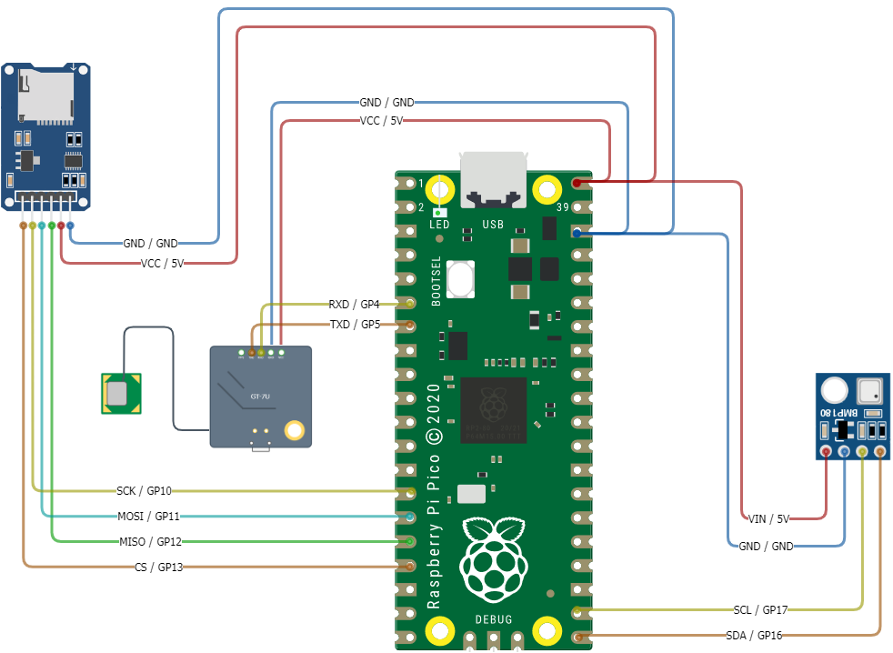

# Lesson 6: Bringing It All Together
## High Altitude Balloon Data Logging

### Pre-requisites
* Complete [Lesson 1: Blinking Light](../lesson1/README.md)
* [Thonny Python IDE](https://thonny.org/) installed on your computer
* All necessary hardware components

### Objectives
* Use all previous lessons to collect data from different modules and write to SD Card

### Results
* A functioning prototype of all modules collecting data and writing to SD Card
* Read results from SD Card and print to console

## Steps

### Hardware Configuration and Wiring

**IMPORTANT** Before wiring your Pico, UNPLUG IT FROM YOUR COMPUTER. If plugged in while wiring, you risk damaging the Pico or SDCard reader.

1. Lessons 3 through 5 include steps needed to wire each module. If needed, reference these previous lessons to wire the individual modules. You may choose to use a breadboard, or wire directly. It is recommended in this lesson to use a breadboard, however, because the number of connections needed requires the use of a shared 5V and Ground bus (see _Fig.2_ below).

    

### Bringing It All Together Program

The code in this lesson will use lessons 3 through 5 to perform all actions of the modules and write data to the SD Card.

1. Using Thonny, open the `main.py` file in [./src/lesson6/main.py](./src/lesson6/main.py).

1. Run the script.

    

    Output will be generated to the console in Thonny describing the actions being taken. You will also see a new directory created on the SD card called `/sd` if using the example code. Within this folder is a file called `data.csv`. You may choose to download this file to your computer and open the file using a program such as Microsoft Excel to read the data in a more familiar program. There is also a helper function in the code to read the data from the file and display it to the console.

    Example output:
    ```
    Writing example data to SD card...
    Done.


    Reading and printing data from SD card...
    ['"98.6"', '"84.5"', '"29.74"', '"40.44922"', '"-89.04319"', '"244"', '"(2023', ' 3', ' 13', ' 16', ' 9', ' 52', ' 0', ' 72)"']
    ['"98.6"', '"84.5"', '"29.74"', '"40.44922"', '"-89.04319"', '"244"', '"(2023', ' 3', ' 13', ' 16', ' 9', ' 52', ' 0', ' 72)"']
    ['"98.6"', '"84.5"', '"29.74"', '"40.44922"', '"-89.04319"', '"244"', '"(2023', ' 3', ' 13', ' 16', ' 9', ' 52', ' 0', ' 72)"']
    ['"98.6"', '"84.5"', '"29.74"', '"40.44922"', '"-89.04319"', '"244"', '"(2023', ' 3', ' 13', ' 16', ' 9', ' 52', ' 0', ' 72)"']
    ['"98.6"', '"84.5"', '"29.74"', '"40.44922"', '"-89.04319"', '"244"', '"(2023', ' 3', ' 13', ' 16', ' 9', ' 52', ' 0', ' 72)"']
    ['"98.6"', '"84.5"', '"29.74"', '"40.44922"', '"-89.04319"', '"244"', '"(2023', ' 3', ' 13', ' 16', ' 9', ' 52', ' 0', ' 72)"']
    Done.
    ```


**Congratulations! You have successfully completed Lesson 6.**