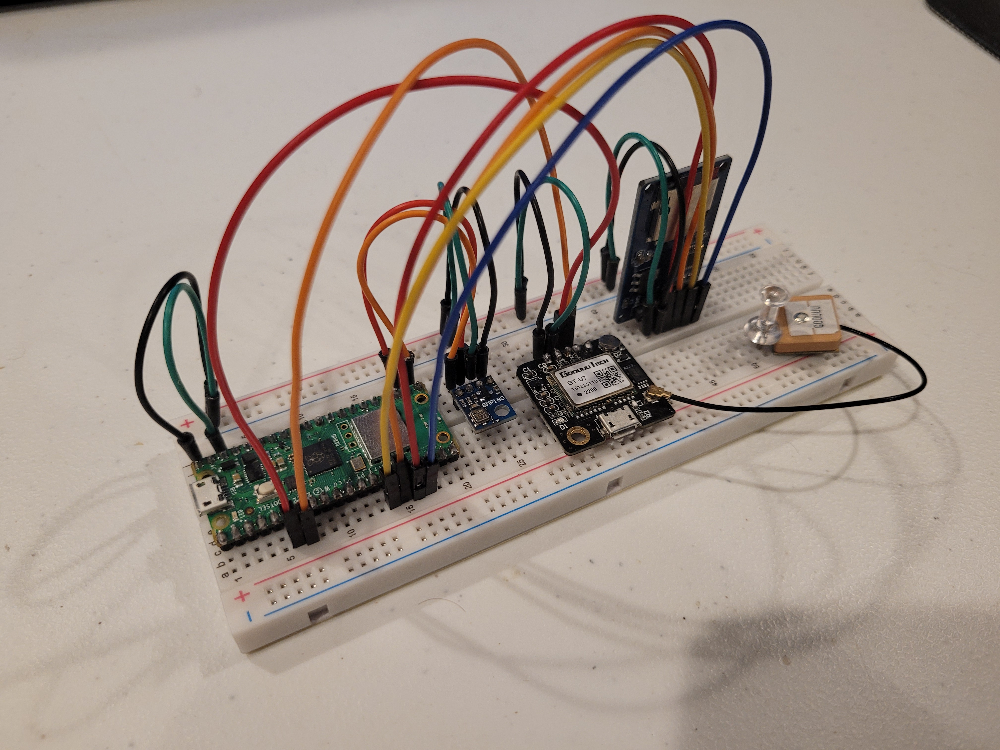
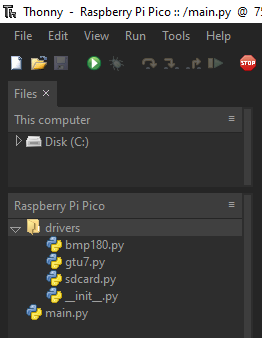

# Lesson 6: Bringing It All Together
## High Altitude Balloon Data Logging

### Pre-requisites
* Complete previous sensor lessons
    * [Lesson 3: Temperature, Pressure, and Altitude](../lesson-3/README.md)
    * [Lesson 4: GPS Coordinates](../lesson-4/README.md)
    * [Lesson 5: Writing Data to SD Card Module](../lesson-5/README.md)
* [Thonny Python IDE](https://thonny.org/) installed on your computer
* All necessary hardware components

### Objectives
* Use all previous lessons to collect data from different modules and write to SD Card

### Results
* A functioning prototype of all modules collecting data and writing to SD Card
* Read results from SD Card and print to console
<br><br>

### Video Walk-through
In addition to the reading below, you can watch this [video](./docs/videos/Lesson6.mp4?raw=true) for guidance!
<br><br>

## Steps

### Hardware Configuration and Wiring

**IMPORTANT** Before wiring your Pico, UNPLUG IT FROM YOUR COMPUTER. If plugged in while wiring, you risk damaging the Pico or SDCard reader.

1. Wire all the modules into the breadboard according to the pin out below:
<br>BB = Bread Board
    Module/Controller Pin | Description | BB/Pi Pico Pins
    ----------- | ----------- | ------------
    ||**SD Card Module**|
    VCC         | (Voltage Common Collector): Provides power to the HW-125.  | BB Power (+)
    GND         | Ground | BB Ground (-)
    SCK         | (Serial Clock): Accepts clock pulses from the Pico to synchronize data transmission | GP10 (14)
    MOSI        | (Master Out Slave In): SPI input to microSD card module | GP11 (15)
    MISO        | (Master In Slave Out): SPI output from the microSD card module | GP12 (16)
    CS          | (Chip Select): Control pin used to select one (or set) of devices on the SPI bus | GP13 (17) 
    ||**GPS Sensor**
    VCC          | (Voltage In): Provides power.  | BB Power (+)
    GND          | Ground | BB Ground (-)
    PPS          | (Pulse Per Second): Assists with synchronization | N/A
    TXD          | (Transmit): Transmission pin used for serial communication | UART1 RX / GP5 (7)
    RXD          | (Receive): Receiver pin used for serial communication | UART1 TX / GP4 (6)
    ||**Pressure Temperature Sensor**
    VIN          | (Voltage In): Provides power to the BMP-180.  | BB Power (+)
    GND          | Ground | BB Ground (-)
    SCL          | (Serial Clock): Accepts clock pulses from the Pico to synchronize data transmission | GP17 (22)
    SDA          | (Serial Data): Used for data exchange | GP16 (21)
    ||**Raspberry Pico**
    5V (40)      | (Voltage In): Provides power.  | BB Power (+)
    GND (38)     | Ground | BB Ground (-)



**Note:** Thumb tack used to hold the GPS antenna up 😋

### Main program

The steps in this section will use the previous hardware and driver sections to allow writing/reading to/from a CSV file, reading GPS data, and pressure/temperature data. The code example for this lesson is located in [./src/main.py](./src/main.py).

1. Using Thonny, open the `main.py` file in [./src/main.py](./src/main.py).

1. Verify that your drivers folder contains all the files needed
   <br>

1. Run the script.
   
    

    Output will be generated to the console in Thonny describing the actions being taken. You will also see a new directory created on the SD card called `/sd` if using the example code. Within this folder is a called called `data.csv`. You may choose to download this file to your computer and open the file using a program such as Microsoft Excel to read the data in a more familiar program.

    


**Congratulations! You have successfully completed Lesson 6.**

<br>

## Want more?
If you have finished with the base lesson, check out the items below.
<br><br>

Things to think about, validate, and/or try:
* Is the data being written out correct? 🤔
* What are some things you could do to test all the modules at once?

Update the code to do any/all of the following:
1. Change the order/format of the output file data to your liking.
1. Write the output as fast as the modules can be read. What is your speed? 😵
<br><br>

## Troubleshooting

* Errors related to individual modules

    If you encounter an error not listed in this section, review the troubleshooting sections of previous lessons for modules you suspect might be causing errors. In each lesson for the modules you will find more example errors and how to fix them.

* `ERROR: No module named (drivers, sdcard, ...)`
    
    If you see this error it means Python is not able to locate a module to be imported. This can occur because the version of MicroPyhon you are using does not support the module you are trying to import. Specifically for this lesson it likely applies to the `drivers` step. Ensure the `drivers` folder and its contents, `sdcard.py` and `__init__.py`, are saved to the Raspberry Pi Pico device and _not_ your computer.

    Example error message:
    ```sh
    Traceback (most recent call last):
      File "<stdin>", line 2, in <module>
    ImportError: no module named 'drivers'
    ```
* Validate that the SD card is 32GB or smaller formatted to FAT32 ([How to Format SD Card on Mac, Windows, Android and Camera](https://www.cisdem.com/resource/how-to-format-sd-card.html) and [partitioning](./docs/images/sdCardFormat.gif))

## Reference Material
* [How to Format SD Card on Mac, Windows, Android and Camera](https://www.cisdem.com/resource/how-to-format-sd-card.html)
* [Raspberry Pi Pico Pinout](https://datasheets.raspberrypi.com/pico/Pico-R3-A4-Pinout.pdf)
* [Raspberry Pi Pico SDK](https://datasheets.raspberrypi.com/pico/raspberry-pi-pico-python-sdk.pdf)
* [MicroPython releases for Pico](https://micropython.org/download/rp2-pico/)
* [MicroPython libraries](https://docs.micropython.org/en/latest/library/index.html)

## Need help?
Watch the walk-through [video](./docs/videos/Lesson6.mp4?raw=true) for guidance!
