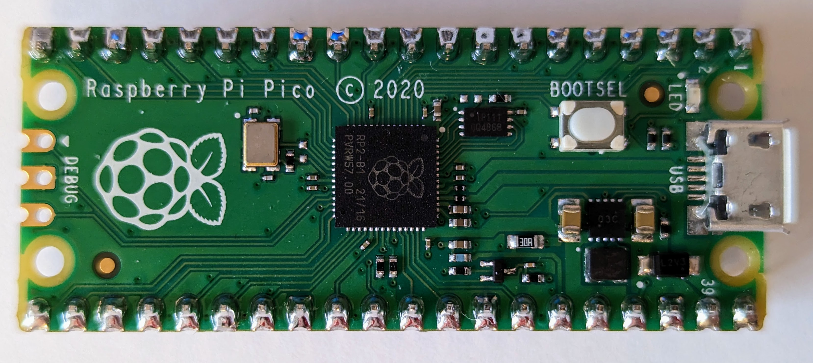
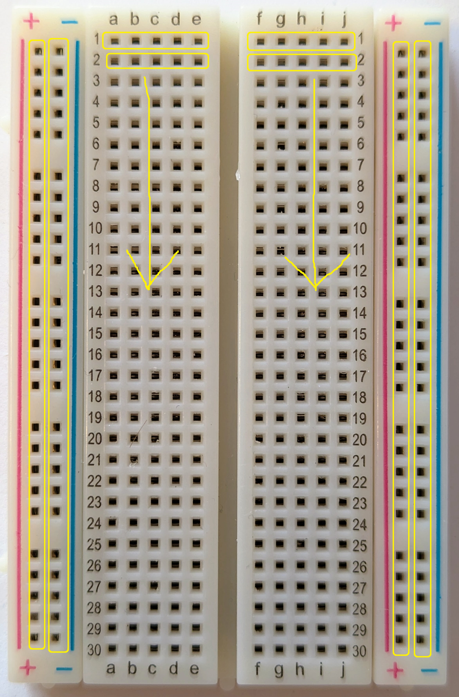

# Lesson #2: Blinky Light
## Introduction to the wiring and programming your Raspberry Pi Pico 

#### What you will need:
 - Raspberry Pi Pico
 - Breadboard
 - 4 Wires
 - 3 Resistors
 - 3 LEDs

#### Objectives
 - Make the onboard LED blink
 - Connect the Pico to three LEDs via a breadboard
 - Blink the three LEDs in sequence
 - Get creative with your code

## Step 1: Get familiar with the Raspberry Pi Pico

This is the top of the Pico.  Notice the small LED in the top right corner of the board and the micorUSB connector on the right side.  The first part of this lesson will blink the small LED.  


This is the bottom of the Pico.  Notice that all of the pins are labeled.  We will connect LEDs to pins GP11, GP12, GP13 later in the lesson.  There are also multiple GND (a.k.a., "Ground") pins on the board and we will be using one of them as well.


## Step 2: Blink the onboard LED

The onboard LED is mapped to pin 25 on the Raspberry Pi Pico.  The following code will blink the onboard LED.  Take some time to read the comments in this code so you understand what is happening, this will help you later in the lesson.  In python, comments are marked with an '#'.

```python
from machine import Pin  #This imports the libraries needed for us to access the Pico and it's pins
import time #The time library will enable us to use the sleep method

#The next few lines creates and initializes a variable "led" as type "Pin" with initialization parameters.  It can also be written in one line like this... led = Pin(25, Pin.OUT)
led = Pin( #Initialize a variable called "led" as a "Pin" object
    25, #Assign pin number 25 (which is the onboard led)
    Pin.OUT) #Specify this is an output pin, meaning we will send data to the pin vs recieving data from it

while True: #A while loop will run until the argument is no longer true.  In this case, True will always be true so it will run forever until we forcefully stop the program
    led.toggle() #Call the "toggle()" function of the led object
    time.sleep(1) #Call the sleep() function of the time object and pass it "1" so it sleeps for 1 second
```

Load and run [BlinkOnboardLEDwithLoop.py](code/BlinkOnboardLEDwithLoop.py) on the Pi and the onboard LED should blink.

Below is a picture of the LED when it is on, it isn't very bright.


## Step 3: Wire the Breadboard

Next we will connect the Pi to a breadboard and wire an LED to one of its pins.

Below is an image of a breadboard, let's get oriented with how it works.  Notice there are a number of rows, marked with numbers and two sets of columns, one marked with letters and another with a + (plus) an - (minus) sign.  Also notice there is a central lane separating the two halves of the breadboard.  

All of the holes in the column with a + (plus) sign are connected and all of the holes in the column with the - (minus) sign are connected.  This allows us to provide power or ground to any pin/device.  The middle matrix of rows/columns marked with numbers/letters are connected differently.  Each numbered row on each side of the center lane is connected as well.

