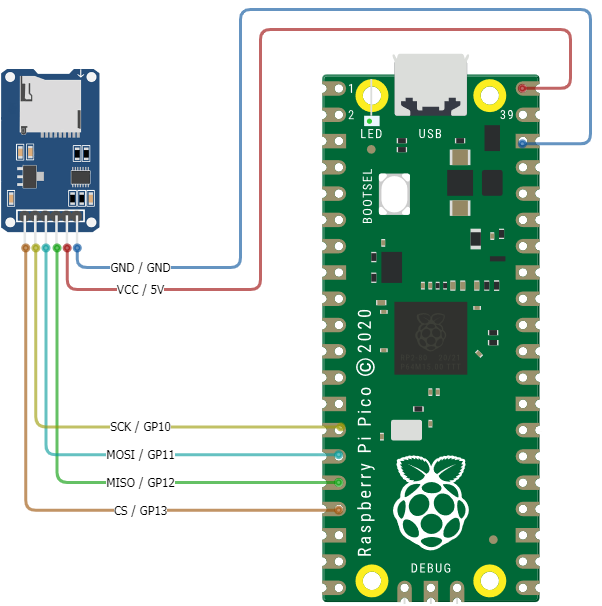

# Lesson 5: Writing Data to SD Card Module
## High Altitude Balloon Data Logging

### Pre-requisites
* Complete [Lesson 1: Blinking Light](../lesson1/README.md)
* [Thonny Python IDE](https://thonny.org/) installed on your computer
* A FAT32 formatted micro SD card. Use [How to Format SD Card on Mac, Windows, Android and Camera](https://www.cisdem.com/resource/how-to-format-sd-card.html) as a guide.
* All necessary hardware components (Raspberry Pi Pico, HW-125 SDCard module, breadboard, wires, USB cable, computer)

### Objectives
* Use breadboard to wire SD Card module to Raspberry Pi Pico
* Install a MicroPython driver to the Raspberry Pi Pico
* Write test data to CSV file stored on the SD Card
* Read test data stored on the SD Card
* Delete test data from SD Card

### Results
* Familiarity with wiring a breadboard
* Understanding of basic MicroPython code
* Learn the importance of MicroPython drivers and how to use them
* A functioning program for storing data on an SD card connected to the Raspberry Pi Pico

 ## Steps

 ### Hardware Configuration and Wiring

 **IMPORTANT** Before wiring your Pico, UNPLUG IT FROM YOUR COMPUTER. If plugged in while wiring, you risk damaging the Pico or SDCard reader.

1. Wire the HW-125 SDCard reader to the Raspberry Pi Pico.
    HW-125 Pins | Description | Pi Pico Pins
    ----------- | ----------- | ------------
    GND         | (Voltage Common Collector): Provides power to the HW-125. Connect to the 5V pin on Pico | GND (38)
    VCC         | (Ground): Connect to the ground pin on Pico | 5V (40)
    SCK         | (Serial Clock): Accepts clock pulses from the Pico to synchronize data transmission | GP10 (14)
    MOSI        | (Master Out Slave In): SPI input to microSD card module | GP11 (15)
    MISO        | (Master In Slave Out): SPI output from the microSD card module | GP12 (16)
    CS          | (Chip Select): Control pin used to select one (or set) of devices on the SPI bus | GP13 (17) 

    

1. Format the micro SD card as `FAT32`. Use [How to Format SD Card on Mac, Windows, Android and Camera](https://www.cisdem.com/resource/how-to-format-sd-card.html) as a guide.

### Install SD Card MicroPython Driver

Drivers are code modules for enabling certain functionality. One such driver allows us to read data from the SD Card module. This driver is called `sdcard.py` and is located in the [../drivers/src/sdcard.py](../drivers/src/sdcard.py) location. The following steps will result in saving this driver to the Raspberry Pi Pico so the driver can be used by our Python code.

1. Download the driver called `sdcard.py` located in the [../drivers/src/sdcard.py](../drivers/src/sdcard.py) location.

1. Connect your Raspberry Pi Pico to your computer using the USB cable.

1. Open the Thonny IDE. _Stop/Restart_ the backend to refresh the connection.

    

    You should now see `Raspberry Pi Pico` displayed in the left-hand navigation of Thonny.

1. If one does not already exist, create a new directory in Thonny on the Raspberry Pi Pic called `drivers`.
    
    

1. Using Thonny, select _File_ then _Open_ from the menu. Choose _This Computer_. Navigate to the location where you downloaded `sdcard.py` in a previous step. Select the file and click _Open_.

1. Save the `sdcard.py` file to the Raspberry Pi Pico. This allows our code to use the driver to perform SD card actions in MicroPython when running on the Pi Pico. 

    Click _File_ then _Save as..._. Choose _Raspberry Pi Pico_. Double-click the `drivers` folder created in a previous step. Then save the `sdcard.py` file being sure to name it `sdcard.py`.

1. If a file called `__init__.py` does not already exist in the `/drivers` folder, create a new file in Thonny called `__init__.py`. 

    Click _File_ then _New_. Then click _File_ then _Save as..._. Choose _Raspberry Pi Pico_ and save this empty file to the same `drivers` location as the previous step. Name the file `__init__.py`. This empty file is used by Python to indicate the `drivers` folder is to be used for Python modules.

### SD Card Reader/Writer Program

The steps in this section will use the previous hardware and driver sections to allow writing to, and reading from a CSV file. The code example for this lesson is located in [./src/lesson5/main.py](./src/lesson5/main.py).

1. Using Thonny, open the `main.py` file in [./src/lesson5/main.py](./src/lesson5/main.py).

1. Run the script.

    

    Output will be generated to the console in Thonny describing the actions being taken. You will also see a new directory created on the SD card called `/sd` if using the example code. Within this folder is a called called `data.csv`. You may choose to download this file to your computer and open the file using a program such as Microsoft Excel to read the data in a more familiar program.


**Congratulations! You have successfully completed Lesson 5.**

## Troubleshooting

* `ERROR: No module named (drivers, sdcard, ...)`
    
    If you see this error it means Python is not able to locate a module to be imported. This can occur because the version of MicroPyhon you are using does not support the module you are trying to import. Specifically for this lesson it likely applies to the `drivers` step. Ensure the `drivers` folder and its contents, `sdcard.py` and `__init__.py`, are saved to the Raspberry Pi Pico device and _not_ your computer.

    Example error message:
    ```sh
    Traceback (most recent call last):
      File "<stdin>", line 2, in <module>
    ImportError: no module named 'drivers'
    ```

## Reference Material
* [How to Format SD Card on Mac, Windows, Android and Camera](https://www.cisdem.com/resource/how-to-format-sd-card.html)
* [Raspberry Pi Pico Pinout](https://datasheets.raspberrypi.com/pico/Pico-R3-A4-Pinout.pdf)
* [Raspberry Pi Pico SDK](https://datasheets.raspberrypi.com/pico/raspberry-pi-pico-python-sdk.pdf)
* [MicroPython releases for Pico](https://micropython.org/download/rp2-pico/)
* [MicroPython libraries](https://docs.micropython.org/en/latest/library/index.html)